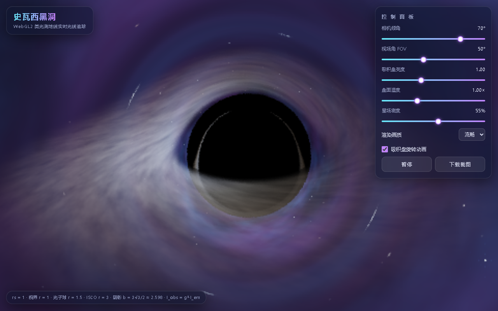

# 史瓦西黑洞实时光线追踪 · Schwarzschild Black Hole Raytracer

单个 HTML 文件、零依赖、双击即开的史瓦西黑洞实时渲染器。
所有画面由 WebGL2 fragment shader 对**史瓦西时空类光测地线**逐步积分得出，不使用任何贴图拼凑。

## 物理特性

所有长度以史瓦西半径 `rs` 归一化（几何单位制，c = G = 1）：

- **测地线积分**：`d²u/dφ² + u = (3/2)·rs·u²`（u = 1/r），等价直角坐标形式 `d²x/dλ² = -(3/2)·rs·h²·x/r⁵`，光子球（r = 1.5）附近自适应加密步长；`r < 1.01` 判定落入视界（纯黑），`r > 30` 判定逃逸到背景天球
- **黑洞阴影**：临界碰撞参数 `b = 3√3/2 ≈ 2.598 rs`，正圆、纯黑、大小不随相机倾角变化
- **薄吸积盘**：内缘 ISCO = 3 rs，外缘 12 rs；径向辐射轮廓 `I ∝ r⁻³(1-√(3/r))`；温度 `T ∝ r^(-3/4)`，内缘约 9500K 白偏蓝 → 外缘约 3000K 橙红（Tanner–Helland 黑体色）
- **相对论效应**：开普勒轨道速度 `β = 1/√(2(r-rs))`（ISCO 处 0.5c），观测强度 `I_obs = g³·I_em`，其中 `g = √(1-rs/r) / [γ(1-β·k)]` 同时包含多普勒效应与引力红移——朝观察者一侧显著更亮更蓝，左右不对称
- **引力透镜**：盘后方的光翻绕到阴影上方/下方成像（《星际穿越》式拱弧）；高阶像在阴影边缘形成细亮**光子环**；背景星光被弯成弧线
- **程序化背景**：哈希网格星场 + fbm 星云，与前景共用同一套测地线积分

## 交互与性能

- 控制面板：相机倾角（0–90°，默认 70°）、视场角、吸积盘亮度/温度、星场密度、渲染画质
- 盘面按开普勒规律较差自转（`ω ∝ r^(-3/2)`）；动画时短窗滑动平均抗锯齿，暂停后时间冻结、长窗累积收敛为无噪点高清静帧
- 交互时自动降低分辨率与积分步数保持流畅，静止后自动回升
- 移动端自动降档；页面不可见时自动暂停；WebGL2 不可用时降级 Canvas 2D 近似渲染并提示"当前为兼容模式"
- 支持一键下载 PNG 截图

## 使用

直接用浏览器打开 `blackhole.html` 即可，无需任何构建或服务器。

## 调参入口

- shader 顶部常量块：`RS / R_HORIZON / R_ISCO / R_ESCAPE / MAX_STEPS`
- `diskShade()`：盘辐射轮廓、温度、湍流、转速（`uTime * 2.4 * pow(r, -1.5)` 中的 2.4）
- JS `PRESETS`：三档画质的分辨率 / 步数 / 步长

## License

MIT
